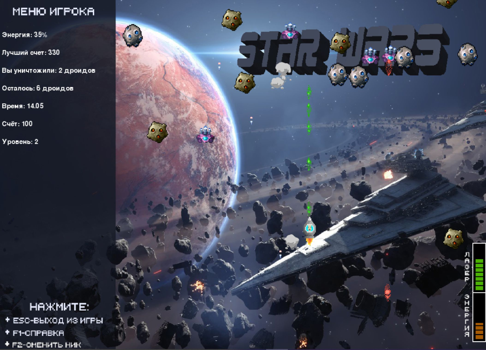
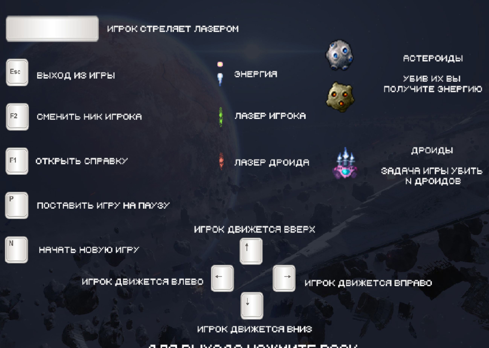
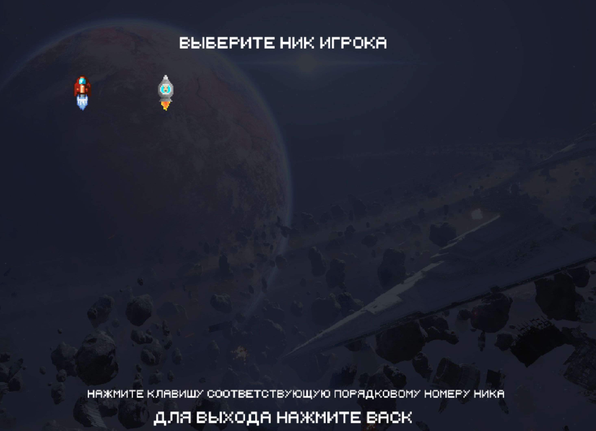

# Звёздные войны
    Игра написана в качестве проекта по pygame в Яндекс Лицей

### Введение
На землю напали дроиды! И этот мир нуждается в защите. Только ты сможешь помочь всем.
Нужно стараться уничтожить как можно больше дроидов.

Соревнуйтесь с друзьями, у кого больше рекордный счет, тот и победил! =)

### Аннотация
Игра оснощена:
+ Шкала энергии игрока 
+ Шкала лазера игрока (постоянно увеличивается)
+ 2 вида астероидов
    + Обычные
    + Энергетические (при уничтожении такого из него выпадет энергия, нужно ее поймать, чтобы пополнить собственную энергию) 
+ Пользователь может сменить собственный ник игрока (пока доступно 2)
+ С каждым уровнем количество необходимого количество дроидов для уничтожения ростет

### Цель игры
Набирать как можно больший счет и не умереть =)
Да и просто весело провести время

### Управление
- Пользователь может управлять космическим кораблем используя клавищи
 Up (W), Down (S), Left(A), Right(D). Перемещение Космического корабля по вертикали возможно
  до середины экрана (так пользователю будет легче ориентироваться в пространстве).
- Стрелять можно при помощи клавиши Space (Приятный бонус =) Если зажать пробел, то лазер будут вылетать плавно)
- С помощью клавиши F1 можно увидеть краткие подсказки по управлению.
- С помощью клавиши F2 можно поменять ник игрока, нажав порядковый номер картинки желаемого ника.
- C помощью клавиши P можно поставить игру на паузу.
- С помощью клавиши N можно начать игру заново.

### Примечание
+ Жизненная энергия возобновляется за счет частичек энергии, выпадающих из энергетических астеромдов
+ Лазер возобновляестя автоматически

### Автосохранение
Игра автоматически сохраняет текущий прогресс и при последующем запуске вы сможете продолжить там,
где закончили. Удалить сохраненную игру можно, нажав кнопку N (новая игра).

### Основное содержание

Видео отрывка игры находится в главной директории проекта, обязательно к просмотру! 

### Запуск игры
    Игра написана под версию Python 3.7
    Python 3.8 еще не поддерживает pygame скачайте python 3.7.x 
    и все будет нормально установлено. Ссылка на python 3.7.5
    -- https://www.python.org/downloads/release/python-375/ - последняя релиз версия 3.7
Просто перейдите в файл main.py и запустите его =)

### Заключение
Мне удалось написать игру на Python с использованием фреймворка Pygame. 
Думаю игра получилась интересной и прикольной, по крайней мере для первого раза =)

### Список сайтов и программ
1. Интернет-ресурсы (Wikipedia, Яндекс фото, Яндекс)
2. Программы:
   - Adobe Photoshop 2020
   - IntelliJ IDEA  2019.3.2
   - GitHub
   - SQLiteStudio
